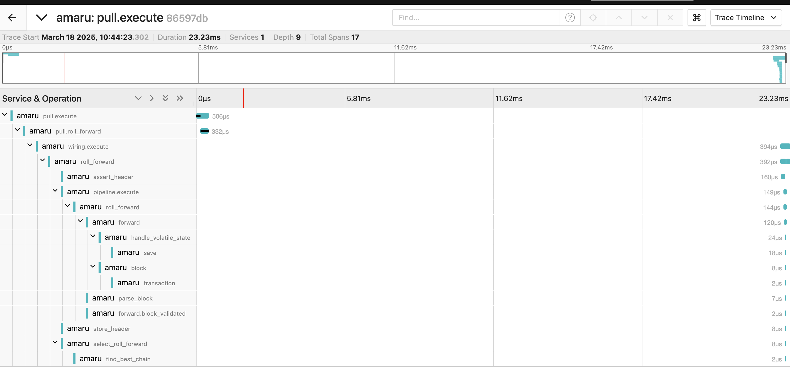

# **Amaru for developpers**

Amaru's main focus is ops and efficiency

But it's also great for developpers

---

# How so?

* Extensibility
* Observability
* Composability
* Multiple targets

---

# Extensibility

Key sub-components can be implemented via Traits

* store
* mempool
* various strategies (e.g. rules validation execution strategy)
* your own? share your feature request

---

# Observability

Internal traces are exposed via [OpenTelemetry](https://opentelemetry.io/)
Observe the whole block execution path

---

# Composability

Amaru is written as a set of modular components
Orchestrate as you wish

See an example of a [simple block execution](https://github.com/jeluard/amaru-experiments/tree/main/standalone/src/main.rs)

---

# Multiple targets

Thanks to rust

* Rapsberry Pi (and any AArch64 linux platforms)
* Wasm
* RISC-V

---

## Multiple targets: Wasm

Targets alternative environments

* browser
* nodejs
* edge (Cloudflare, Vercel, ..)

Can be wrapped in JS libs (see [amaru-js](https://github.com/jeluard/amaru-js))

---

## Multiple targets: RISC-V

Used by most zkVM

Foundation for:
* privacy
* scalability

---

# Ideas

* custom node
* proof of validation
* bitcoin ZK rollup
* privacy
* alternative to daedalus
* amaru as an MCP server

Feel free to [discuss your ideas!](https://github.com/pragma-org/amaru/discussions/60)

---

# Demo

* amaru-js
* tauri

---

# Questions ?

Find some of those experiments at [github.com/jeluard/amaru-experiments](https://github.com/jeluard/amaru-experiments)

Find this presentation at [jeluard.github.io/amaru-experiments](https://jeluard.github.io/amaru-experiments)

 

